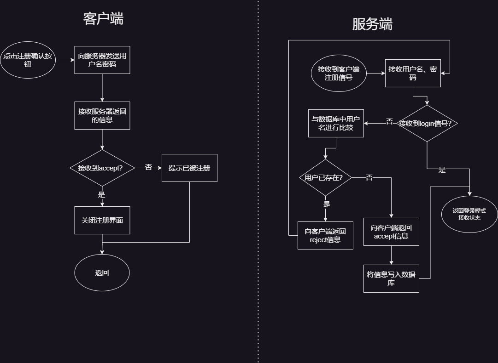
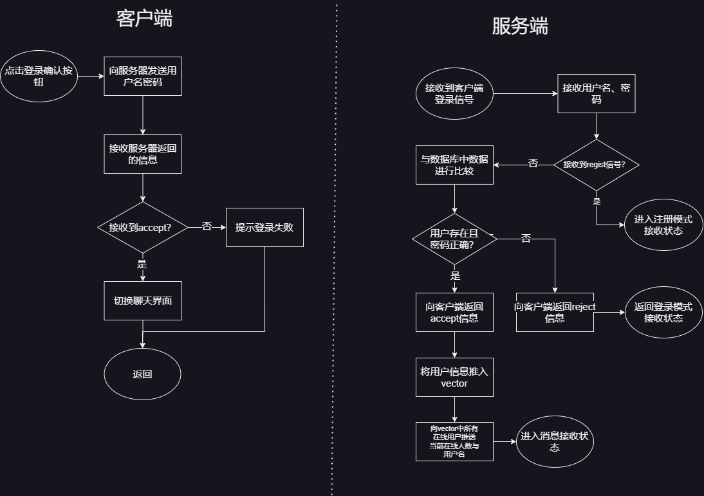
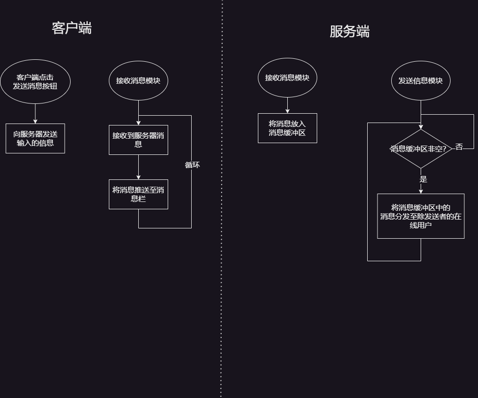

# 聊天室说明 "Chatting Room" Introduction
>小组成员：鲍梓涵、陈海桥、王天亮

---
## 0. 目录
- [聊天室说明 "Chatting Room" Introduction](#聊天室说明-chatting-room-introduction)
	- [0. 目录](#0-目录)
	- [1. 技术基础](#1-技术基础)
		- [1.1 服务端](#11-服务端)
		- [1.2 客户端](#12-客户端)
	- [2. 代码组成](#2-代码组成)
		- [2.1 包含头文件/库](#21-包含头文件库)
			- [2.1.1 服务端](#211-服务端)
			- [2.1.2 客户端](#212-客户端)
		- [2.2 数据结构](#22-数据结构)
			- [2.2.1 服务端](#221-服务端)
			- [2.2.2 客户端](#222-客户端)
		- [2.3 部分函数介绍](#23-部分函数介绍)
			- [2.3.1 UTF-8转GBK(通用)](#231-utf-8转gbk通用)
			- [2.3.2 获取本机ip(通用)](#232-获取本机ip通用)
			- [2.3.3 验证登录/注册(服务端)](#233-验证登录注册服务端)
			- [2.3.4 根据Socket删除在线用户(服务端)](#234-根据socket删除在线用户服务端)
			- [2.3.5 发送输出缓冲区信息至在线用户(服务端)](#235-发送输出缓冲区信息至在线用户服务端)
			- [2.3.6 接受在线用户信息(客户端)](#236-接受在线用户信息客户端)
	- [3. 主要功能](#3-主要功能)
		- [3.1 服务端](#31-服务端)
		- [3.2 客户端](#32-客户端)
	- [4. 逻辑思想](#4-逻辑思想)
		- [4.1 注册](#41-注册)
		- [4.2 登录](#42-登录)
		- [4.3 聊天](#43-聊天)
---

## 1. 技术基础
本程序分为两个组成部分: 服务端&客户端<br>
### 1.1 服务端
   - C语言
   - 网络基础
### 1.2 客户端
   - C\C++语言
   - Qt窗口开发
   - 网络基础
---

## 2. 代码组成

### 2.1 包含头文件/库
#### 2.1.1 服务端
```
- stdio.h		//输入输出
- iostream		//输入输出
- string.h		//字符串相关
- winsock2.h	//网络连接
- vector		//在线用户
- queue			//消息队列
- algorithm		//remove_if()函数删除在线用户
- Windows.h		//创建线程
- direct.h		//文件夹操作
- io.h			//文件夹操作
- ws2_32.lib	//Winsock依赖库
```

#### 2.1.2 客户端
```
- stdio.h						//输入输出
- iostream						//输入输出
- string						//字符串相关
- Windows.h						//创建线程
- winsock2.h					//网络连接
- qregularexpression			//限制输入格式
- QRegularExpressionValidator	//限制输入格式
- QtWidgets/QApplication		//创建QWidget对象
- qlistwidget.h					//创建QListWidget对象
- qstringlistmodel.h			//创建QStrigListModel对象
- ws2_32.lib					//Winsock依赖库
- cwchar						//宽字符转换
- cstring						//宽字符转换
```

### 2.2 数据结构

#### 2.2.1 服务端<br>

```C
//存放输入数据
typedef struct {
SOCKET socket;							//对应用户socket
SOCKET c_socket;						//对应用户socket2
char* client_ip;						//用户ip地址
char username[username_length];			//用户名
} Data;

//输入信息
typedef struct {
SOCKET sender_socket;					//发送者socket
char* client_ip;						//发送者ip
char* username;							//发送者用户名
string message;							//发送的信息
} Messages;

vector<Data> clients;     				//在线人员列表
queue<Messages> messages; 				//发送信息缓冲

bool status1 = true;  					//是否有人正在连接
bool status2 = true;  					//是否在发送信息
const int username_length = 1024;		//最大用户名长度
const int password_length = 1024;		//最大密码长度
const int message_length = 1024;		//最大消息长度
const int line_len = 120;				//DOS窗口宽度
```

#### 2.2.2 客户端

```C++
std::string localip;					//本地ip
SOCKET client_socket, client_socket_c;	//两个socket
bool connect_status = true;				//是否连接成功
int client_count = 0;					//在线用户数量
char e_server_ip[256] = { 0 };			//服务器ip
char c_username[1024] = { 0 };			//用户名(char)
const int username_length = 1024;		//最大用户名长度
const int password_length = 1024;		//最大密码长度
const int message_length = 1024;		//最大消息长度
const char* status = "login";			//登录界面状态
```

### 2.3 部分函数介绍
#### 2.3.1 UTF-8转GBK(通用)
<details><summary><mark>点击查看代码</mark></summary>

```C++
inline string utg(const string& utf8Str) {
// 首先计算需要的宽字符串长度
int wideLength = MultiByteToWideChar(CP_UTF8, 0, utf8Str.c_str(), -1, nullptr, 0);
std::vector<wchar_t> wideStr(wideLength);

// 将UTF-8转换为宽字符串
MultiByteToWideChar(CP_UTF8, 0, utf8Str.c_str(), -1, &wideStr[0], wideLength);

// 计算GBK字符串长度
int gbkLength = WideCharToMultiByte(CP_ACP, 0, &wideStr[0], -1, nullptr, 0, nullptr, nullptr);
std::vector<char> gbkStr(gbkLength);

// 将宽字符串转换为GBK字符串
WideCharToMultiByte(CP_ACP, 0, &wideStr[0], -1, &gbkStr[0], gbkLength, nullptr, nullptr);

return string(gbkStr.begin(), gbkStr.end() - 1); // 减去末尾的空字符
}
```
</details>

#### 2.3.2 获取本机ip(通用)
<details><summary><mark>点击查看代码</mark></summary>

```C
std::string getlocalip() {
	int ret;
	char hostname[256] = { 0 };
	ret = gethostname(hostname, sizeof(hostname));
	hostent* host = gethostbyname(hostname);
	return inet_ntoa(*(struct in_addr*)*host->h_addr_list);
}
```
</details>

#### 2.3.3 验证登录/注册(服务端)
<details><summary><mark>点击查看代码</mark></summary>

```C++
// 登录验证
string check_data_login(char* username, char* password) {
    FILE* file = fopen(DATABASE_USER_INFO, "r");
    FILE* fileb = fopen(DATABASE_BAN_LIST, "r");
    // 定义文件指针history_file，并通过fopen以只读方式打开历史消息文件（".data/messages.txt"），若打开失败则返回"reject"
    FILE* history_file = fopen(DATABASE_MESSAGES, "r");
    if (file == NULL || fileb == NULL) {
        return "reject";
    }

    char line[username_length];
    //封禁检测
    while (fgets(line, username_length, fileb) != NULL) {
        char storedUsername[username_length];
        int ret = sscanf(line, "%s", storedUsername);
        storedUsername[strlen(storedUsername)] = '\0';
        if (ret <= 0) {
            printf("\rstr Error!\n");
            printf("\r/>");
            return "reject";
        }
        if (!strcmp(storedUsername, username)) {
            return "ban";
        }
    }
    //账户存在检测
    while (fgets(line, sizeof(line), file) != NULL) {
        char storedUsername[username_length];
        char storedPassword[password_length];
        int ret = sscanf(line, "%s %s", storedUsername, storedPassword);
        if (ret != 2) {
            printf("\rstr Error!\n");
            printf("\r/>");
            return "reject";
        }
        storedUsername[strlen(storedUsername)] = '\0';
        storedPassword[strlen(storedPassword)] = '\0';
        if (strcmp(username, storedUsername) == 0 && strcmp(password, storedPassword) == 0) {
            g_historyMessages.clear();  // 先清空全局变量中的历史消息列表（避免之前残留数据影响）
            char history_line[message_length];
            // 使用fgets从history_file指向的历史消息文件中逐行读取消息，将每行消息存入g_historyMessages全局向量中
            while (fgets(history_line, message_length, history_file) != NULL) {
                g_historyMessages.push_back(history_line);
            }
            fclose(history_file);  // 完成历史消息读取后，关闭文件，释放资源
            fclose(file);
            fclose(fileb);
            return "accept";
        }
    }

    fclose(file);
    fclose(fileb);
    fclose(history_file);
    return "reject";
}
```
</details>

#### 2.3.4 根据Socket删除在线用户(服务端)
<details><summary><mark>点击查看代码</mark></summary>

```C++
// 移除客户端连接相关信息
void remove_client(SOCKET target_socket) {
    clients.erase(
        remove_if(clients.begin(), clients.end(),
            [&target_socket](const Data& s) {
                return target_socket == s.socket;
            }), clients.end()
    );
}
```
</details>

#### 2.3.5 发送输出缓冲区信息至在线用户(服务端)
<details><summary><mark>点击查看代码</mark></summary>

```C
// 发送线程
DWORD WINAPI Send(LPVOID lpThreadParameter) {
    while (1) {
        if (!messages.empty()) {
            //向非分发信息的客户端发送消息缓冲池的消息
            status1 = false;
            string temp;
            temp.append(messages.front().username);
            temp.append(":");
            temp.append(messages.front().message);
            writeMessageToDatabase(temp.c_str());
            cout << "\r分发消息至:[ ";
            for (auto& clt : clients) {
                //如果是发送者，则跳过
                if (messages.front().sender_socket == clt.socket) {
                    continue;
                }
                while (!status2);
                send(clt.socket, temp.c_str(), username_length, 0);
                cout << clt.socket << " ";
            }
            cout << "]" << endl;
            printf("\r/>");
            status1 = true;
            messages.pop();
        }
    }
    return 0;
}
```
</details>

#### 2.3.6 接受在线用户信息(客户端)
<details><summary><mark>点击查看代码</mark></summary>

```C++
//接收在线用户信息线程
DWORD WINAPI Receive_clients(LPVOID lpThreadParameter) {
	struct Q2type data = *(struct Q2type *)lpThreadParameter;	//将传入的数据转化至结构体
	QListWidget* message_list = data.message_list;				//将结构体信息转化至QListWidget对象
	QLabel *label_count = data.client_count;					//将结构体信息转化至QListWidget对象
	//设置列表属性
	message_list->setSpacing(5);
	message_list->setEditTriggers(QAbstractItemView::NoEditTriggers);
	while (connect_status);										//等待连接成功,防止Socket未创建时调用recv函数报错
	while (1) {
		char c_client_count[256] = { 0 };						
		recv(client_socket_c, c_client_count, 256, 0);			//接收人数
		c_list.clear();	
		message_list->clear();
		client_count = charToint(c_client_count);				//人数charToInt
		label_count->setText(c_client_count);					//显示人数
		char info[username_length] = { 0 };						//建立用户列表
		for (int i = 0; i < client_count; i++) {				
			recv(client_socket_c, info, username_length, 0);	//读取用户名
			c_list.append(info);								//向列表加入用户
		}
		QStringListModel* c_listmodel = new QStringListModel(c_list);
		message_list->addItems(c_list);							//显示列表
	}
}
```
</details>

---

## 3. 主要功能
### 3.1 服务端
 1. [x] 存储用户信息
 2. [x] 用户登录注册验证
 3. [x] 消息中转分发
 4. [x] 用户权限管理
 5. [x] 指令控制 
 6. [x] 消息存储
### 3.2 客户端
1. [x] 连接指定服务器
2. [x] 登录注册
3. [x] 查看在线用户
4. [x] 发送接收信息
5. [ ] 头像显示
---

## 4. 逻辑思想
### 4.1 注册
<details><summary><mark>点击查看流程图</mark></summary>


</details>

### 4.2 登录
<details><summary><mark>点击查看流程图</mark></summary>


</details>

### 4.3 聊天
<details><summary><mark>点击查看流程图</mark></summary>


</details>

---
